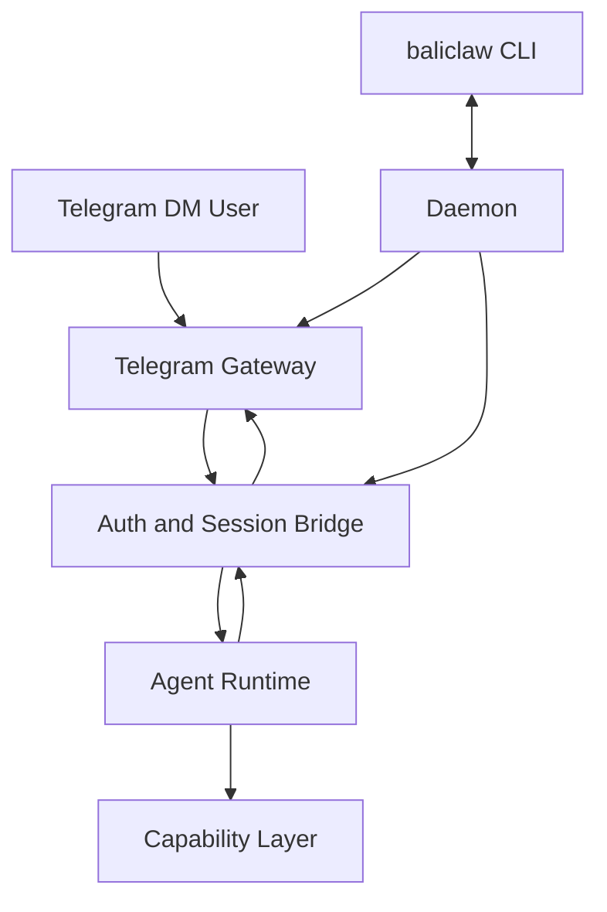

# BaliClaw - 极简 OpenClaw 风格指挥塔 MVP 设计规格

## 1. 愿景与定位

**项目代号**: BaliClaw

**目标**: 构建一个极简、无头、本地优先的 AI 网关。它不追求复刻 OpenClaw 的全部能力，而是先验证一条最小可用路径:

1. 从 Telegram DM 收到消息
2. 完成身份配对与授权
3. 将消息路由到本地 Agent Runtime
4. 持久化会话并返回结果

**定位**: 这是一个“可扩展的最小核心”，不是一次性做完的完整替代品。MVP 只支持:

- Telegram
- 单账号
- 单 Agent
- DM only

但内部接口必须从第一天就为以下扩展预留边界:

- group / channel
- topic / thread
- 多 channel
- 多 account
- 多 agent

---

## 2. 设计原则

### 2.1 范围先收紧，再扩展

MVP 只做 Telegram DM-only。群聊、topic、thread、Discord/Slack/WhatsApp 不进入第一阶段实现。

### 2.2 Phase 1 行为要简单，但接口不能写死 Telegram DM

虽然第一版只接 Telegram 私聊，但入站消息、出站目标、会话键、权限模型都要设计成可升维，而不是直接把 `userId` 当系统主键。

### 2.3 Claude Code SDK 是 Runtime，控制面仍归 BaliClaw

Claude Code SDK 负责推理、工具调用和会话持久化；BaliClaw 自己负责:

- 外部会话键
- channel 路由
- pairing / allowlist
- 配置与热更新

约束:

- BaliClaw 负责定义稳定的 `sessionId` 命名规则
- Claude Code SDK 直接使用该 `sessionId` 做持久化
- BaliClaw 不再额外维护 `externalKey -> sdkSessionId` 映射表

### 2.4 安全边界分层

需要至少区分三层:

1. 谁能发消息进来
2. 这个消息属于哪个会话
3. 这个会话被允许调用哪些本地能力

`pairing`/`allowlist` 只解决第 1 层，不等于 shell/file system 安全。

### 2.5 守护进程默认非交互

Daemon 默认运行在无 TTY 环境下。因此不依赖实时 `y/N` 终端交互。所有审批操作都必须可通过显式 CLI 命令完成。

---

## 3. MVP 范围

### 3.1 In Scope

- 本地守护进程
- 本地 CLI
- Telegram Bot API 长轮询
- DM pairing / approve 流程
- 单 Agent 文本对话
- 稳定 `sessionId` 约定
- 极简本地配置文件
- 有限热更新

### 3.2 Out of Scope

- 所有 Web UI / Canvas / A2UI / 移动端 UI
- group / topic / thread 的实际功能
- 多 agent 路由
- 多账号
- 复杂 control plane
- 分布式 node / companion app
- 完整 OpenClaw 技能与插件生态兼容
- 零中断热重载保证

---

## 4. 核心架构总览

系统分为五层:

1. **Daemon & CLI**
2. **Telegram Gateway**
3. **Auth & Session Bridge**
4. **Agent Runtime**
5. **Capability Layer**



### 4.1 关键边界

- Telegram Gateway 只负责接入 Telegram，不拥有业务状态
- Auth & Session Bridge 负责 pairing、会话键与授权状态
- Agent Runtime 不知道 Telegram 细节，只消费标准化入站消息
- Capability Layer 不默认等于“主机 shell 全开放”

---

## 5. Phase 1 核心数据模型

这一节只保留 Phase 1 实际使用的字段。

### 5.1 ChatType

```typescript
type ChatType = "direct" | "group" | "channel";
```

### 5.2 InboundMessage

```typescript
interface InboundMessage {
  channel: "telegram";
  accountId: "default";
  chatType: "direct";
  conversationId: string;
  senderId: string;
  text: string;
}
```

### 5.3 DeliveryTarget

```typescript
interface DeliveryTarget {
  channel: "telegram";
  accountId: "default";
  chatType: "direct";
  conversationId: string;
}
```

### 5.4 SessionId 约定

Claude Code SDK 直接使用 BaliClaw 定义的稳定 `sessionId`。

```typescript
type SessionId = string;
```

Phase 1 约定:

- Telegram DM: `telegram:default:direct:<senderId>`

说明:

- BaliClaw 决定 `sessionId` 的字符串规则
- Claude Code SDK 负责基于该 `sessionId` 读写历史
- Phase 1 不引入额外映射表

---

## 6. 模块详细设计

### 6.1 Daemon 与 CLI

**目标**: 提供本地控制面，但不引入复杂 Web 控制台。

#### Daemon

- 常驻后台运行
- 启动 Telegram Gateway
- 启动本地 IPC 接口
- 管理配置加载、`sessionId` 规则、pairing store

IPC 形式可选:

- Unix Domain Socket
- 仅监听 `127.0.0.1` 的本地 HTTP

#### CLI (`baliclaw`)

CLI 只做本地控制，不直接处理 channel 业务。

示例命令:

```bash
baliclaw daemon start
baliclaw config get
baliclaw config set telegram.botToken <TOKEN>
baliclaw pairing list telegram
baliclaw pairing approve telegram <CODE>
baliclaw status
```

#### 关键约束

- Daemon 不依赖交互式 TTY prompt
- 所有审批必须能通过命令重放
- 配置写入必须原子化
- 所有可变状态写入都由 daemon 持有

#### 状态一致性规则

- CLI 不直接修改配置文件、allowlist 文件或 pairing store 文件
- `baliclaw pairing approve ...`、`baliclaw config set ...` 等命令一律通过 IPC 请求 daemon
- daemon 完成写入后，立即刷新内存态并返回结果
- Phase 1 不允许 CLI 绕过 daemon 直接写 store

---

### 6.2 接入层: Telegram Gateway

**目标**: 只实现 Telegram DM 接入闭环。

#### Phase 1 能力

- 使用 Bot Token 建立 Telegram 长轮询
- 只接受 direct chat
- 忽略 group / supergroup / channel
- 标准化入站消息
- 发送最终回复

#### Phase 1 不承诺的能力

- forum topics
- DM topics
- reply threading
- message edit streaming
- group mention gating

#### 热更新策略

Phase 1 只支持**有限热更新**:

- 文本配置热加载
- Token 或连接参数变化时允许重启 Telegram connector

不承诺:

- 零中断
- 所有配置项都能无重连生效

---

### 6.3 安全层: Pairing 与 DM 授权

**目标**: owner-only 单用户安全模型。

#### DM Policy

Phase 1 仅支持 DM，默认策略为:

- `pairing`

流程:

1. 未知 Telegram 用户发来 DM
2. Gateway 不处理正文
3. 生成 pairing code
4. 通过 Telegram 回复 pairing code
5. 操作员在本机执行:

```bash
baliclaw pairing list telegram
baliclaw pairing approve telegram <CODE>
```

6. 该 senderId 进入 allowlist
7. 后续消息才允许进入 Runtime

#### 状态存储

由 daemon 持久化:

- `pairing requests`
- `approved allowlist`

#### CLI 与 Daemon 的审批链路

1. CLI 通过 IPC 调用 `pairing.approve`
2. daemon 校验 pairing code
3. daemon 更新 allowlist store
4. daemon 刷新内存中的授权状态
5. daemon 返回审批结果给 CLI

#### 关键边界

- Phase 1 只有 DM 授权
- 不把 DM pairing 设计成未来 group 授权的通用机制
- group / channel 将来必须有单独的 allowlist 与 policy

---

### 6.4 会话层: 稳定 SessionId 规则

**目标**: 让 Claude Code SDK 直接使用稳定的业务会话键。

#### Phase 1 会话键规则

```typescript
function buildSessionId(message: InboundMessage): string {
  return `${message.channel}:${message.accountId}:${message.chatType}:${message.senderId}`;
}
```

说明:

- 对 Telegram DM-only 来说，`senderId` 是稳定的会话主键
- `conversationId` 主要用于出站目标和未来扩展

#### 未来扩展规则

当引入 group/topic/thread 时:

- direct: 保持 `direct:<senderId>`
- group: `group:<conversationId>`
- channel: `channel:<conversationId>`
- thread/topic: 作为附加维度追加

因此 Phase 1 的 `sessionId` 规则不会阻碍后续升维。

---

### 6.5 引擎层: Claude Code SDK Runtime

**目标**: 使用标准 SDK 负责 Agent 循环、原生工具与会话持久化。

#### Runtime 职责

- 接收标准化文本输入
- 调用模型
- 执行工具
- 返回最终输出

#### Session 策略

直接把 BaliClaw 生成的稳定 `sessionId` 传给 SDK。

SDK 负责:

- 基于 `sessionId` 恢复历史
- 推理循环
- tool / hook 生命周期

#### Agent 形态

Phase 1 固定为单 Agent:

```typescript
const mainAgent = createMainAgent({
  id: "main",
  systemPrompt: loadAgentsMd(),
  tools: loadedTools,
});
```

#### Prompt 来源

Phase 1 可以加载:

- 工作目录中的 `AGENTS.md`
- 本地配置中的系统提示补充

不做:

- 多 agent 路由
- topic 级 agentId
- 子 agent 自动分发

这些都留到后续阶段。

---

### 6.6 能力层: SDK 原生工具、技能与 MCP

这是最容易被低估的部分，因此分阶段推进。

#### Phase 1: 直接使用 SDK 原生工具

第一版不自造文件与 shell 工具轮子，直接复用 Claude Code SDK 原生能力。

优先使用:

- `Bash`
- `Read`
- `Write`
- `Edit`
- 以及 SDK 版本内可用的其他原生文件工具

#### 工具安全模式

Phase 1 只支持一种运行策略:

1. `owner_trusted`

Phase 1 约束:

- 已通过 DM pairing 的 owner 被视为受信任操作者
- `Read` / `Write` / `Edit` / `Bash` 不进入运行时人工审批队列
- 不启用会导致 SDK 等待交互式确认的审批模式
- 工具风险控制主要依赖:
  - 严格的 `allowedTools`
  - owner-only pairing
  - 最小化默认工具面

工具启用方式:

- 通过 SDK 的 `allowedTools` 控制可见工具面
- Phase 1 固定为 owner-trusted
- MVP 不实现基于 `child_process.exec` 的自定义 shell 包装层

#### 为什么 Phase 1 不做运行时工具审批

因为 BaliClaw Daemon 运行在无 TTY 环境中，而 SDK 的交互式权限提示不适合作为后台守护进程的默认审批通道。

如果在 daemon 中直接启用需要交互确认的审批模式，运行中的工具调用可能会卡在不可见、不可响应的等待状态，导致当前任务甚至整个 bot 行为异常。

因此:

- Phase 1 明确不支持 runtime tool approval
- 任何需要审批的策略都推迟到后续阶段

#### 技能格式

Phase 1 不实现“把任意目录脚本自动转换成 SDK tools”。

只支持两类轻量能力:

1. **Prompt-only skills**
   - 以 `SKILL.md` 为基础格式
   - 作用是给 Agent 提供额外说明

2. **显式 SDK Tool 配置**
   - 通过 `allowedTools` 和本地配置启用
   - 不从任意脚本目录自动推断 schema

#### MCP

MCP 不再被排除在架构外，但放在 Phase 4 接入。

约束:

- 优先使用 Claude Code SDK 原生 MCP 接口
- BaliClaw 只负责本地配置与启停边界
- MVP 不实现自定义 MCP 协议桥

#### 后续阶段的正确审批接入方式

如果未来需要对 `Write` / `Edit` / `Bash` 做运行时审批，必须满足以下约束:

1. 不依赖终端 TTY prompt
2. 通过 Claude Code SDK 的权限回调机制接管审批
3. 审批请求进入 daemon 持有的任务队列
4. 操作员通过 CLI 调用 daemon IPC 完成 approve / deny
5. daemon 再把审批结果回传给 SDK

也就是说，后续若实现 `approval_required`，唯一可接受的路径是:

- SDK callback
- daemon task queue
- CLI over IPC

而不是后台进程直接等待 stdin / stdout 交互。

---

## 7. Phase 1 与未来扩展的兼容策略

### 7.1 为什么 Phase 1 只做 Telegram DM-only 仍然可扩展

因为下面这些抽象在第一天就保留了:

- `chatType = direct | group | channel`
- `conversationId`
- `accountId`
- `sessionId` 命名规则
- `delivery target`

所以未来支持 group/topic/thread 时，主要是新增分支，而不是推翻模型。

### 7.2 未来扩展方向

#### Telegram group / topic / thread

需要新增:

- group access policy
- mention gating
- topic-aware session key
- thread-aware reply target

#### Slack / Discord / WhatsApp

当前模型已基本兼容，但会新增 provider-specific 差异:

- Slack / Discord 有 `channel` 语义
- Discord thread 更接近子 channel
- Telegram topic 更接近 group 下的 thread 维度
- WhatsApp group 是 group，不是 channel

因此不能把 Telegram 的 `message_thread_id` 抽象成所有平台都一样的 thread。

---

## 8. 核心数据流

### 8.1 Phase 1 正常消息流

1. 用户向 Telegram Bot 发送 DM
2. Telegram Gateway 收到更新
3. 检查 sender 是否已配对
4. 若未配对:
   - 生成 pairing code
   - 回复 pairing 提示
   - 终止本次处理
5. 若已配对:
   - 构造 `InboundMessage`
   - 生成稳定 `sessionId`
   - 以该 `sessionId` 调用 Claude Code SDK
   - 获得最终文本结果
   - 发送回 Telegram DM

### 8.2 本地审批流

1. 操作员执行:

```bash
baliclaw pairing list telegram
baliclaw pairing approve telegram ABCD1234
```

2. CLI 通过 IPC 请求 daemon 审批
3. daemon 更新 pairing / allowlist store
4. daemon 刷新内存中的授权状态
5. 该 sender 后续 DM 可进入 Runtime

---

## 9. 实施路线图

### Phase 1: Telegram DM-only 通路

- [ ] 初始化 TypeScript 项目
- [ ] 实现 Daemon 与本地 CLI
- [ ] 实现 Telegram Bot 长轮询
- [ ] 仅接收 direct chat
- [ ] 实现 pairing list / approve
- [ ] 实现 echo 闭环

### Phase 2: Agent Runtime 与稳定 SessionId

- [ ] 接入 Claude Code SDK
- [ ] 实现稳定 `sessionId` 规则
- [ ] 加载 `AGENTS.md`
- [ ] 跑通纯文本 Agent 对话

### Phase 3: SDK 原生工具接入

- [ ] 启用 SDK 原生 `Read`
- [ ] 启用 SDK 原生 `Write`
- [ ] 启用 SDK 原生 `Edit`
- [ ] 启用 SDK 原生 `Bash`
- [ ] 收紧 `allowedTools` 默认集合
- [ ] 以 owner-trusted 模式跑通高风险工具

### Phase 4: Prompt-only Skills、MCP 与配置热更新

- [ ] 支持基于 `SKILL.md` 的 prompt-only skills
- [ ] 接入 SDK 原生 MCP 配置
- [ ] 增加有限配置热更新
- [ ] 支持 Telegram connector 重连

### Phase 5: 扩展到 group / topic / 其他 channels

- [ ] 引入 `groupPolicy`
- [ ] 引入 mention gating
- [ ] 支持 Telegram topic/thread
- [ ] 抽象 Slack / Discord / WhatsApp channel adapter
- [ ] 如有需要，再实现基于 SDK callback + daemon IPC 的工具审批流

---

## 10. 明确的妥协与取舍

### 10.1 为什么不一开始就做 group/topic/thread

因为这三类功能会显著拉高复杂度:

- 会话键规则变复杂
- 回复目标不再等于 sender
- 授权模型从 DM allowlist 变成 group policy + sender policy + mention gating

它们适合作为 Phase 5，而不是 MVP 门槛。

### 10.2 为什么不一开始就做完整技能自动适配

因为“技能提示词”与“可执行工具”是两种完全不同的安全等级。

把任意目录脚本自动变成 tool，会引入:

- schema 推断复杂度
- 执行模型复杂度
- 安全边界不清

MVP 应先用 SDK 原生工具，把技能层收窄为 prompt-only。

### 10.3 为什么 Phase 1 不做运行时工具审批

因为 daemon 常驻运行时通常没有稳定 TTY。

如果让后台 daemon 直接进入 SDK 的交互式工具审批流，任务可能会卡在不可见的等待状态，形成运行时阻塞。

所以 Phase 1 的取舍是:

- 只做 owner-trusted
- 不做 runtime tool approval
- 不做 Telegram 内联按钮审批
- 不做 daemon 内部审批队列

等未来需要更强的安全控制时，再补:

- SDK 权限回调接管
- daemon 审批任务队列
- CLI over IPC 的 approve / deny

### 10.4 为什么不依赖交互式 CLI 授权

因为 daemon 常驻运行时通常没有稳定 TTY。

显式 CLI 审批:

- 可重试
- 可脚本化
- 可在 SSH / systemd / pm2 环境下稳定工作

---

## 11. MVP 成功标准

满足以下条件即认为第一阶段成功:

1. Telegram 未授权用户发消息时能收到 pairing code
2. 操作员可用 CLI 查看并批准 pairing
3. 获批用户后续消息可进入同一持久化会话
4. Agent 可回复纯文本结果
5. Daemon 重启后:
   - pairing allowlist 不丢
   - 相同 `sessionId` 可恢复历史会话

---

## 12. 一句话总结

BaliClaw 的正确起点不是“从 OpenClaw 里砍掉 UI 后把剩下所有东西一次性搬过来”，而是:

**先做一个 Telegram DM-only、单账号、单 Agent、可持久化、可审批、可扩展的最小核心；再在这个核心上逐步长出 group、topic、thread 和多 channel。**
