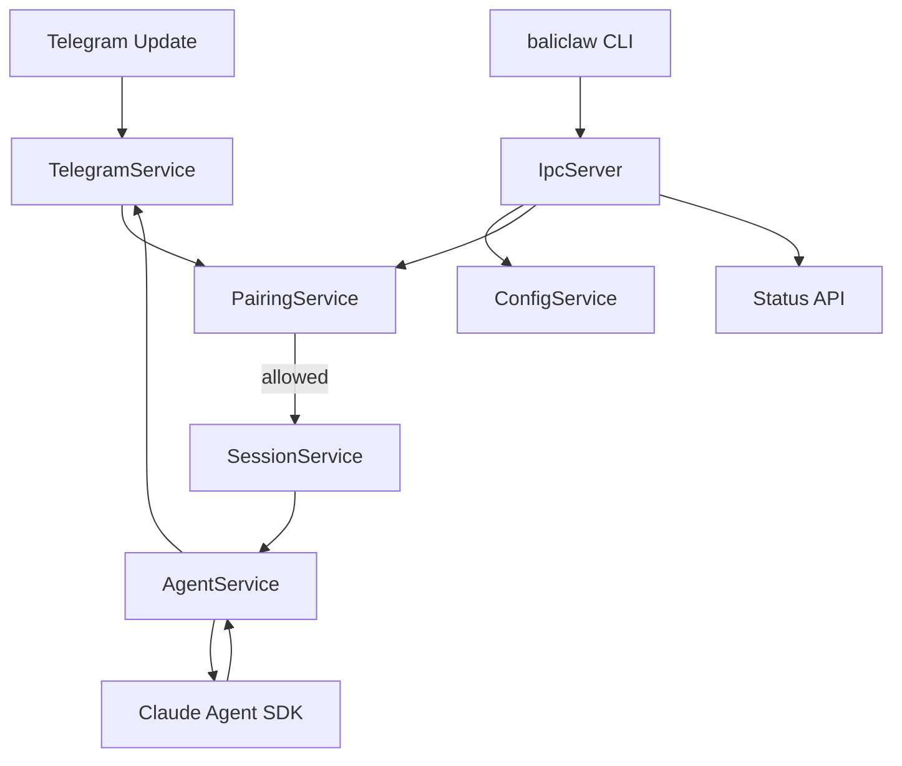

# BaliClaw 技术规格

## 1. 文档目的

本文档基于 `design-spec.md`，将 Phase 1 的产品设计收敛为可执行的开发技术规格。

Phase 1 目标如下：

- Telegram DM-only
- single account
- single agent
- 本地 daemon + 本地 CLI
- Node.js + TypeScript + Claude Agent SDK

这份文档比设计文档更具体，重点回答“怎么实现”。当设计假设与当前 Claude Agent SDK 实际接口不一致时，以 SDK 官方接口为准。

---

## 2. 范围

### 2.1 In Scope

- daemon 进程
- 本地 CLI 客户端
- Telegram 长轮询接入
- DM pairing 与本地审批
- Claude Agent SDK 集成
- 稳定业务会话键
- prompt-only skills
- 有限配置热更新

### 2.2 Out of Scope

- groups / channels / topics / threads
- 多账号路由
- 多 agent 编排
- runtime tool approval queue
- 自定义 MCP bridge
- Web UI

---

## 3. 技术栈

### 3.1 运行时

- Node.js `22+`
- TypeScript `5.x`
- ESM modules
- package manager: `pnpm`

### 3.2 核心依赖

- `@anthropic-ai/claude-agent-sdk`
  - Claude Agent TypeScript SDK
  - 使用 `query()`
  - 使用 `sessionId`
  - 使用 `tools`
  - Phase 1 使用 `permissionMode: "bypassPermissions"`
  - Phase 1 使用 `allowDangerouslySkipPermissions: true`
- `grammy`
  - Telegram Bot API 客户端
  - 长轮询接入
- `commander`
  - CLI 参数解析
- `zod`
  - 运行时配置校验
- `json5`
  - 人可读可写的配置格式
- `chokidar`
  - 配置文件监听
- `pino`
  - 结构化日志
- `vitest`
  - 测试框架

### 3.3 Claude Agent SDK 使用约定

Phase 1 以无交互模式运行 SDK：

- 使用 `query({ prompt, options })`
- 使用 `sessionId` 将 BaliClaw 的稳定业务会话键直接绑定到 SDK 持久化
- 使用 `tools` 限制暴露给模型的内置工具集合
- 使用 `permissionMode: "bypassPermissions"` 避免 daemon 在无 TTY 环境中卡死
- 使用 `allowDangerouslySkipPermissions: true` 显式确认 Phase 1 为 owner-trusted 模式
- `canUseTool` 预留给后续审批流
- `mcpServers` 预留给后续阶段

实现约束：

- 当前 TypeScript SDK 暴露了可调用方指定的 `sessionId`
- 因此 Phase 1 不需要额外维护本地 `session index`
- BaliClaw 只负责生成稳定会话键，并将其传入 `options.sessionId`
- daemon 实现中禁止调用 `process.chdir()`
- 工作目录必须通过每次 `query()` 的 `options.cwd` 显式传入

---

## 4. 总体架构

### 4.1 进程模型

系统包含两个可执行入口：

1. `baliclawd`
   - 常驻 daemon
   - 持有所有可变状态
   - 持有 Telegram 连接
   - 持有 Claude Agent SDK 执行权

2. `baliclaw`
   - 短生命周期 CLI
   - 通过 IPC 调用 daemon
   - 不直接修改配置文件或 store

### 4.2 Daemon 内部服务

daemon 内部包含以下服务：

- `ConfigService`
- `IpcServer`
- `TelegramService`
- `PairingService`
- `SessionService`
- `AgentService`
- `SkillsService`
- `ReloadService`

### 4.3 运行流



---

## 5. 推荐目录结构

初始目录建议如下：

```text
baliclaw/
  src/
    cli/
      index.ts
      commands/
        daemon.ts
        config.ts
        pairing.ts
        status.ts
      client.ts
    daemon/
      index.ts
      bootstrap.ts
      shutdown.ts
    ipc/
      server.ts
      client.ts
      schema.ts
      handlers/
        config.ts
        pairing.ts
        status.ts
    config/
      schema.ts
      service.ts
      paths.ts
      file-store.ts
    telegram/
      service.ts
      normalize.ts
      send.ts
    auth/
      pairing-service.ts
      pairing-store.ts
    session/
      stable-key.ts
      turn-queue.ts
    runtime/
      agent-service.ts
      sdk.ts
      prompts.ts
      skills.ts
      tool-policy.ts
    shared/
      types.ts
      logger.ts
      keyed-queue.ts
      atomic-write.ts
  test/
```

---

## 6. 配置与状态

### 6.1 状态根目录

应用状态统一放在：

```text
~/.baliclaw/
```

Phase 1 文件布局：

```text
~/.baliclaw/
  baliclaw.json5
  baliclaw.sock
  pairing/
    telegram-pending.json
    telegram-allowlist.json
  logs/
    daemon.log
```

### 6.2 配置文件格式

配置文件路径：

```text
~/.baliclaw/baliclaw.json5
```

Phase 1 配置结构：

```ts
type BaliClawConfig = {
  telegram: {
    enabled: boolean;
    botToken: string;
  };
  runtime: {
    model?: string;
    maxTurns?: number;
    workingDirectory?: string;
    systemPromptFile?: string;
  };
  tools: {
    availableTools?: string[];
  };
  skills?: {
    enabled?: boolean;
    directories?: string[];
  };
  logging?: {
    level?: "debug" | "info" | "warn" | "error";
  };
};
```

### 6.3 配置校验规则

- 当 `telegram.enabled=true` 时，`telegram.botToken` 必填
- `tools.availableTools` 默认值为最小内置工具集合
- `runtime.workingDirectory` 默认值为 daemon 当前工作目录
- Phase 1 拒绝未知顶层配置项

### 6.4 配置写入规则

所有配置写入都必须经过 daemon：

1. 解析 JSON5
2. 用 Zod 校验
3. 临时文件写入
4. 原子重命名替换
5. 刷新内存配置
6. 发出 reload 事件

---

## 7. 共享类型

Phase 1 核心运行时类型：

```ts
export type ChatType = "direct";

export interface InboundMessage {
  channel: "telegram";
  accountId: "default";
  chatType: "direct";
  conversationId: string;
  senderId: string;
  text: string;
}

export interface DeliveryTarget {
  channel: "telegram";
  accountId: "default";
  chatType: "direct";
  conversationId: string;
}

export interface PairingRequest {
  code: string;
  senderId: string;
  username?: string;
  createdAt: string;
  expiresAt: string;
}
```

说明：

- Phase 1 只保留实际会用到的字段
- `accountId` 固定为 `"default"`，为后续多账号预留稳定接口
- `conversationId` 用于出站寻址
- `senderId` 用于 pairing 与 `sessionId` 生成

---

## 8. IPC 设计

### 8.1 传输方式

Phase 1 使用 Unix Domain Socket 上的 HTTP。

原因：

- 请求响应模型简单
- CLI 调用成本低
- 不暴露本地 TCP 端口
- 后续演进为 JSON RPC 风格也容易

Socket 路径：

```text
~/.baliclaw/baliclaw.sock
```

### 8.2 IPC 接口

Phase 1 需要以下接口：

- `GET /v1/ping`
- `GET /v1/status`
- `GET /v1/config`
- `POST /v1/config/set`
- `GET /v1/pairing/list?channel=telegram`
- `POST /v1/pairing/approve`

示例请求体：

```json
{
  "channel": "telegram",
  "code": "ABCD1234"
}
```

### 8.3 CLI 规则

- 当 daemon socket 不可用时，CLI 立即失败
- CLI 不实现离线 fallback 写文件
- 所有 mutation 命令尽量设计成幂等

---

## 9. Telegram 接入服务

### 9.1 库选择

使用 `grammy` + 长轮询。

原因：

- 对 Telegram Bot API 封装稳定
- TypeScript 体验好
- 样板代码较少

### 9.2 Phase 1 行为

- 只接收 private chat
- 忽略 group、supergroup、forum、channel 更新
- 忽略非文本消息
- 将文本标准化成 `InboundMessage`

### 9.3 更新处理流程

伪代码：

```ts
onTelegramMessage(update) {
  if (!isPrivateChat(update)) return;
  if (!hasText(update)) return;

  const inbound = normalizeTelegramDm(update);
  daemon.enqueueInboundMessage(inbound);
  return;
}
```

实现要求：

- Telegram update handler 只做轻量校验、标准化与投递
- handler 不直接等待 Agent 完整执行结束
- 真正的串行执行由 daemon 内部 keyed queue 保证
- 这样可以避免慢请求阻塞整个 polling 消费链路

### 9.4 出站发送

Phase 1 只支持文本回复：

```ts
sendText({
  conversationId,
  text,
});
```

Phase 1 明确不支持：

- message edit
- typing indicator
- reply threading
- attachments

---

## 10. Pairing 服务

### 10.1 策略

Phase 1 pairing 策略为：

- Telegram DM sender 必须先进入 allowlist
- 未授权 sender 收到 pairing code
- 原始消息不进入 runtime

### 10.2 持久化文件

pending requests：

- `~/.baliclaw/pairing/telegram-pending.json`

allowlist：

- `~/.baliclaw/pairing/telegram-allowlist.json`

### 10.3 Pairing 规则

- code 长度：`8`
- 仅大写字母和数字
- 排除易混淆字符
- TTL：`1 hour`
- 每个 sender 同时只能有一个 active request
- 最大 pending request 数量：`3`

### 10.4 Pairing 流程

入站流程：

1. 收到 Telegram DM
2. 查询 allowlist
3. 如果 sender 未授权：
   - upsert pending request
   - 发送 pairing code
   - 终止本次消息处理

审批流程：

1. 操作员执行 `baliclaw pairing approve telegram <CODE>`
2. CLI 通过 IPC 请求 daemon
3. daemon 校验 pairing code
4. daemon 将 sender 写入 allowlist
5. daemon 删除对应 pending request

### 10.5 Store 实现

Phase 1 使用 JSON 文件 + 原子重写。

不使用 SQLite，原因如下：

- 写入频率很低
- 文件便于人工查看和排障
- daemon 是唯一写入者

---

## 11. 会话服务

### 11.1 稳定会话键

Phase 1 使用如下规则生成稳定 `sessionId`：

```ts
function buildSessionId(message: InboundMessage): string {
  return `telegram:default:direct:${message.senderId}`;
}
```

规则说明：

- 使用 `senderId` 作为 DM 会话所有者
- 生成结果在 daemon 重启后必须保持一致
- 该字符串直接传给 SDK 的 `options.sessionId`

### 11.2 并发控制

同一个稳定会话键在任意时刻只允许一个 active turn。

实现方式：

- daemon 内部维护 keyed async queue
- 以稳定会话键作为队列 key
- 不静默丢消息
- 后续消息等待前一个 turn 完成

该机制用于避免：

- Claude turn 重叠执行
- 会话顺序错乱
- Telegram 重复回复

---

## 12. Agent 服务

### 12.1 SDK 包装层

围绕 `query()` 做一层薄包装：

```ts
interface RunAgentInput {
  prompt: string;
  sessionId: string;
  workingDirectory: string;
}

interface RunAgentResult {
  text: string;
  usage?: {
    totalCostUsd?: number;
    turns?: number;
  };
}
```

### 12.2 单次调用策略

每次入站 turn 的执行流程：

1. 计算稳定 `sessionId`
2. 组装 prompt
3. 调用 SDK `query()`
4. 消费流式事件直到最终 `result`
5. 提取最终输出文本

### 12.3 SDK 默认参数

Phase 1 默认参数：

```ts
options = {
  cwd,
  maxTurns: 8,
  sessionId,
  permissionMode: "bypassPermissions",
  allowDangerouslySkipPermissions: true,
  tools: ["Bash", "Read", "Write", "Edit"],
  systemPrompt: {
    type: "preset",
    preset: "claude_code",
    append: appendSystemPrompt,
  },
}
```

`cwd` 约束：

- `cwd` 必须来源于配置或显式运行上下文
- 禁止通过 `process.chdir()` 修改全局工作目录
- 如果未来发现某个 SDK 内置工具未正确遵守 `options.cwd`，必须在运行时适配层显式修复，不能依赖全局目录切换

### 12.4 结果处理

最终用户可见回复统一来自最终 `result` 事件。

SDK 返回结果的处理原则：

- `success`：发送结果文本
- `error_max_turns`：发送可读的失败提示
- `error_during_execution`：发送失败提示，同时记录详细日志

### 12.5 后续审批扩展

Phase 1 不实现运行时工具审批。

后续如果要实现审批，必须使用：

- `canUseTool`
- 或 `permissionPromptToolName`

审批决策必须走 daemon 自己维护的状态与 IPC 闭环，不能依赖终端 stdin。

---

## 13. Skills 服务

### 13.1 Phase 1 目标

Phase 1 只支持 prompt-only skills。

### 13.2 Skill 发现路径

读取以下位置：

- `<workingDirectory>/skills/*/SKILL.md`
- 配置文件中声明的额外目录

### 13.3 Skill 加载规则

- 只读取 `SKILL.md`
- 不执行 skill 脚本
- 不推断 schema
- 不做二进制检查
- 不做 per-skill enablement UI

### 13.4 Prompt 组装顺序

Prompt 组装顺序如下：

1. runtime 基础 system prompt
2. `AGENTS.md` 内容
3. 配置中的额外 system prompt
4. 拼接后的 prompt-only skills

建议使用清晰分隔符：

```text
=== AGENTS.md ===
...

=== SKILL: foo ===
...
```

---

## 14. 工具策略

### 14.1 Phase 1 默认工具集

即使在 owner-trusted 模式下，工具面也应保持收敛。

推荐默认工具：

- `Read`
- `Write`
- `Edit`
- `Bash`

Phase 1 默认不启用：

- browser tools
- web search
- notebook tools
- MCP tools
- subagent tools

### 14.2 Owner-Trusted 语义

owner-trusted 的含义是：

- 无运行时审批提示
- 工具可立即执行
- 风险由已完成 pairing 的 owner 承担

Phase 1 可以接受该模式，是因为：

- 只有单一 owner
- 只接受 Telegram DM
- 工具集合显式收敛

---

## 15. 热更新模型

### 15.1 监听输入

Phase 1 只监听：

- `~/.baliclaw/baliclaw.json5`

Phase 1 不监听：

- pairing stores
- skills 目录

### 15.2 Reload 语义

采用 debounce 后的配置重载流程：

1. 解析配置
2. 校验配置
3. diff 新旧配置

后续动作：

- logging 配置：热应用
- runtime prompt 配置：热应用
- tool allowlist：对后续 turn 热应用
- Telegram token 变化：重启 Telegram polling service

Phase 1 不承诺零中断。

---

## 16. 日志与可观测性

### 16.1 Logger

使用 `pino` 输出 JSON 日志。

每条日志建议包含：

- timestamp
- level
- subsystem
- stable session key
- Telegram sender id

### 16.2 子系统名称

建议统一使用以下子系统名：

- `daemon`
- `ipc`
- `config`
- `telegram`
- `pairing`
- `session`
- `agent`
- `skills`

### 16.3 敏感信息规则

禁止记录：

- bot token
- 原始 API keys
- 失败场景下的完整 prompt，除非显式开启 debug

---

## 17. 错误处理

### 17.1 Telegram 错误

- 可恢复的 polling / 网络错误自动重试
- bot token 无效时启动阶段直接失败
- `baliclaw status` 必须能暴露当前状态

### 17.2 SDK 错误

- 记录 SDK stderr 回调
- 分类最终 result subtype
- 在错误日志中带上 `sessionId` 便于关联排障

### 17.3 IPC 错误

- 返回结构化 JSON error
- 包含 `code` 和 `message`
- 默认不向 CLI 暴露 stack trace

---

## 18. 测试计划

### 18.1 单元测试

- 配置解析与校验
- pairing store 行为
- 稳定 `sessionId` 生成
- keyed queue 串行化
- prompt 组装
- Agent options 组装时正确传递 `cwd`

### 18.2 集成测试

- CLI -> IPC -> daemon pairing approve 流程
- 未配对 Telegram DM 返回 pairing code，且不触发 SDK
- 已配对 Telegram DM 会调用 SDK 并返回结果
- daemon 重启后，复用同一个 `sessionId` 时仍能延续同一条 SDK 会话
- Telegram handler 在消息入队后立即返回，不等待 Agent 完整执行
- SDK 调用在指定 `cwd` 下运行，不能污染其他并发会话的工作目录

### 18.3 Test Double

默认测试套件中应 mock：

- Telegram transport
- Claude Agent SDK `query()`

默认测试不依赖真实 Telegram 或真实 Anthropic API。

---

## 19. 交付里程碑

### 19.1 Milestone 1

- daemon 能启动
- IPC ping/status 可用
- config load 可用

### 19.2 Milestone 2

- Telegram DM 收发打通
- pairing list/approve 打通

### 19.3 Milestone 3

- Claude Agent SDK 集成打通
- 已配对用户能获得带会话持续性的回复

### 19.4 Milestone 4

- prompt-only skills
- config reload
- 生产可用性加固

---

## 20. 开发前待确认问题

编码前需要明确以下问题：

1. Phase 1 是否继续通过 Telegram 回传 pairing code，还是改成 silent pending approval？
2. 状态目录是否固定为 `~/.baliclaw`，还是从第一天支持 `BALICLAW_HOME`？
3. Phase 1 是否默认启用 `Bash`，还是改成配置显式开启？
4. daemon 是否只暴露 Unix socket IPC，还是也提供 loopback HTTP fallback？

---

## 21. 总结

Phase 1 的最小实现是一个单进程本地 daemon，它具备以下能力：

- 接收 Telegram DMs
- 执行 owner pairing
- 对每个 sender 串行化 turn
- 以稳定 `sessionId` 复用 Claude Agent SDK 会话
- 以 owner-trusted 模式使用 SDK 原生工具
- 通过本地 IPC 暴露所有可变控制操作

这是在不引入 UI 和复杂控制面的前提下，仍然具备后续扩展能力的最小实现方案。
